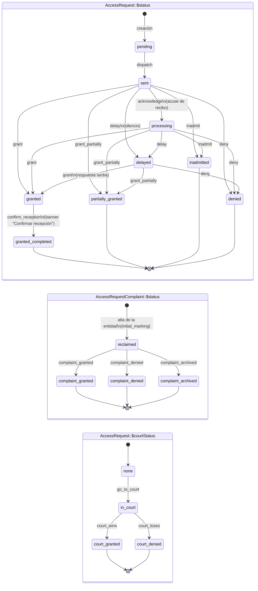
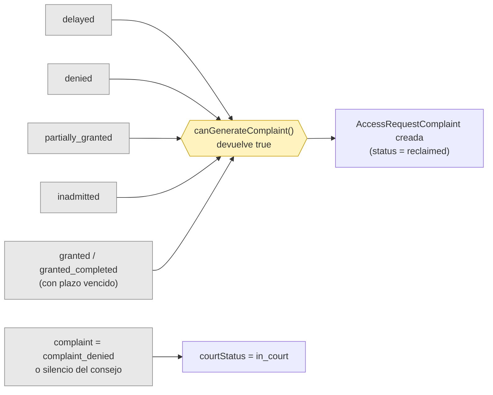

# Workflow de solicitudes

Ciclo de vida completo de una solicitud de acceso desde su presentación hasta la resolución.

## Estados

Una solicitud de acceso transita por estos estados principales (consulta `AccessRequest::STATUS_*` y `config/packages/workflow.yaml`):

| Estado | Etiqueta | Significado |
|--------|----------|-------------|
| `pending` | Pendiente de recepción | Creada pero aún no confirmada como enviada (borrador previo al envío) |
| `sent` | Enviada | Presentada ante el organismo público, a la espera de respuesta |
| `processing` | En trámite | El organismo público ha acusado recibo y está tramitando |
| `granted` | Concedida (pendiente de recepción) | Solicitud aprobada — a la espera de que se entregue la información |
| `granted_completed` | Concedida y completada | Solicitud aprobada e información recibida |
| `partially_granted` | Estimación parcial | El organismo público ha concedido parte de la solicitud |
| `inadmitted` | Inadmitida a trámite | El organismo público se ha negado a admitir la solicitud |
| `denied` | Denegada | Solicitud denegada de forma expresa |
| `delayed` | Silencio administrativo | Vencido el plazo de respuesta sin contestación (silencio administrativo = denegación implícita) |

### Estado vs. resultado — la posición en el workflow no es la decisión administrativa

`status` describe **en qué punto del procedimiento se encuentra la solicitud**; no es un registro fiable de lo que la administración ha decidido realmente. La decisión vive en `AccessRequest::$resolutionResult` (`granted | partially_granted | denied | inadmitted | silence | NULL`) y ambos evolucionan de forma independiente:

- Una solicitud puede permanecer en `granted_completed` (el ciudadano ha recibido la documentación) mientras `resolutionResult = partially_granted` — la concesión original fue parcial y una transición posterior del workflow no sobrescribe ese hecho.
- Una solicitud marcada como `granted` puede no corresponderse con lo que se entregó realmente; el ciudadano puede presentar una reclamación sin que el resultado vuelva a `denied`.
- `delayed` es una posición del workflow (silencio detectado); `resolutionResult = silence` es el equivalente a la decisión registrado para consumidores aguas abajo (p. ej., el mapeo de motivos de reclamación).

La misma ortogonalidad se aplica al lado de las reclamaciones — véase `docs/complaint-workflow.md`.

## Diagrama del ciclo de vida

Generado a partir de `config/packages/workflow.yaml`. Las tres máquinas de estado son ortogonales: la solicitud (`AccessRequest::$status`) avanza por la principal, y la reclamación (`AccessRequestComplaint::$status`) y la vía judicial (`AccessRequest::$courtStatus`) corren en paralelo cuando aplican.



### Disparadores de la creación de cada flujo paralelo



> Los terminales del diagrama de estados son terminales **del workflow principal**, no del expediente: la solicitud puede seguir generando actividad vía reclamación o vía judicial sin que `$status` cambie. La sección [Relación con `AccessRequestComplaint`](#relación-con-accessrequestcomplaint) detalla la ortogonalidad y cómo los terminales conviven con los flujos paralelos.

## Ciclo de vida

### 1. Creación

Una solicitud puede crearse de tres maneras:

**Creación manual.** La persona usuaria rellena un formulario con título, descripción, organismo público, ley aplicable, fecha de envío y, opcionalmente, un número de referencia externo. El sistema calcula el plazo de respuesta a partir de la fecha de envío y la ley aplicable.

**Creación a través del agente.** "Realizar" permite redactar y despachar una solicitud nueva al agente. El selector detecta automáticamente qué canal de presentación corresponde (`ChannelResolver`):

- **AGE Portal de Transparencia** cuando `PublicBody.transparencyPortalAmbId !== null` (el `idAmb` del wizard; el agente construye con él la URL `/procedimiento/formulario?idProc=133628&idAmb={ID}`). El campo informativo `transparencyPortalUrl` no determina el canal.
- **REG / RED SARA** cuando el organismo tiene al menos un `RegDestination` activo importado desde DIR3 (véase `docs/documentacion-procesos-envio/redsara_reg.md`). Los borradores REG recogen `expone` y `solicita` (máx. 4000 caracteres cada uno) en lugar de una única descripción, y requieren la dirección postal y el teléfono de la persona usuaria (`/perfil/datos-personales`) antes del envío.

#### Selección de destinatario (picker en cascada)

El picker de "Realizar solicitud" (`templates/solicitudes/realizar/picker.html.twig`,
controlador Stimulus `assets/controllers/realizar_picker_controller.js`) guía al usuario en
4 pasos. El marcado y los estilos de la cascada viven en dos parciales compartidos
(`templates/_partials/organism_picker.html.twig` y `_partials/organism_picker_styles.html.twig`)
que reutiliza también "Solo redactar" (véase más abajo):

1. **Nivel de administración** (obligatorio): Estado, Autonómica, Local, Justicia,
   Universidades, Otras Instituciones. Definidos en
   `src/Service/Submission/RegAdministrationLevel.php`.
2. **Ámbito** (opcional, depende del nivel): desplegable de **ministerios** para Estado,
   o de **comunidades autónomas** para Autonómica / Local / Justicia. Servido por
   `GET /solicitudes/nueva/realizar/facetas.json?nivel={clave}`
   (`app_solicitudes_realizar_facets_json`).
3. **Organismo** (obligatorio): autocompletar contra
   `GET /solicitudes/nueva/realizar/organismos.json` (`app_solicitudes_realizar_bodies_json`),
   que filtra los cuerpos enviables por `nivel` + ámbito (`ministerio` o `comunidad`). Incluye
   cuerpos REG/RED SARA y cuerpos del Portal de Transparencia AGE; estos últimos solo aparecen
   en el nivel Estado.
4. **Unidad** (solo organismos REG): la `RegDestination` concreta (p. ej. una concejalía de un
   Ayuntamiento), servida por
   `GET /solicitudes/nueva/realizar/organismos/{publicBody}/unidades.json`
   (`app_solicitudes_realizar_units_json`).

El filtrado se deriva en tiempo de consulta de `RegDestination.nivelAdministracion`,
`RegDestination.comunidad` y la Raíz (`RegDestination.publicBody`); no se denormaliza nada en
`PublicBody` (cuyo `level` solo distingue estado/autonómica/local). El usuario completa la
cascada, pulsa **"Añadir destinatario"** —que apila el organismo junto a su unidad en el panel
derecho y resetea la cascada— y repite para enviar a varios organismos. "Continuar" hace
`POST /solicitudes/nueva/realizar/iniciar` (`app_solicitudes_realizar_initiate`) con
`{ targets: [{ publicBodyId, regDestinationId? }] }`, sin cambios respecto al flujo anterior.

Detalle de diseño:
`docs/superpowers/specs/2026-06-07-regdestination-cascade-selector-design.md`.

**"Solo redactar" (borrador sin envío).** `/solicitudes/nueva/redactar`
(`app_solicitudes_draft_only`, `templates/solicitudes/draft-only-picker.html.twig`) usa el
**mismo picker en cascada** —incluido el selector de Unidad de destino (`RegDestination`) para
organismos REG— reutilizando los parciales compartidos y el controlador `realizar-picker` con
`data-realizar-picker-draft-only-value="true"`. "Continuar" hace el mismo
`POST /solicitudes/nueva/realizar/iniciar` pero con `{ targets, draftOnly: true }`; en ese modo
`initiateDrafts` marca cada solicitud con la metadata `draft_only` y **omite la comprobación de
datos personales REG** (se difiere al momento de "Enviar" desde el lienzo, ya que el borrador no
se despacha todavía). Ambos flujos aterrizan en el mismo lienzo de redacción
(`app_solicitudes_realizar_draft`).

**Asistente de redacción.** El canvas "Realizar" alberga un único asistente conversacional (`AssistantChatController` → `POST /asistente/request/{id}`, SSE; controlador Stimulus `assistant-chat`). El modelo **decide automáticamente** en cada turno si responder con una pregunta o actuar sobre el canvas:
- El system prompt codifica una política de tres acciones y pide al modelo que emita la respuesta conversacional, después un marcador literal `===DECISION===` y luego un bloque JSON `{"action":"reply"|"generate"|"rewrite", "draft":{…}}`.
- `App\Service\AI\StreamingDecisionSplitter` separa el stream del LLM en torno al marcador, de modo que los tokens del chat pueden enviarse en vivo mientras el JSON se acumula y se parsea al final.
- El composer es un textarea multilínea (Enter para enviar, Shift+Enter para salto de línea) y acepta adjuntos (PDF/PNG/JPG/CSV/TXT/MD; ≤4 MB/archivo, ≤5 MB total) que viajan como `ContentPart`s solo en ese turno — no se persisten en S3.
- Después de cada `rewrite`, la burbuja del sistema incluye un botón "Ver cambios" (controlador `diff-modal`) que abre un modal con un diff línea a línea del título + EXPONE/SOLICITA (o cuerpo único) frente al snapshot anterior. No se almacena historial de versiones; el snapshot vive en los data-attributes de la burbuja del chat solo durante esa sesión.

El prompt de generación de la solicitud se gestiona en Langfuse bajo el nombre `pideinfo-request-generate-request-chat`, con fallback bundled en `config/prompts/request/generate-request-chat.md`. El protocolo de chat (política de decisión `reply`/`generate`/`rewrite`, formato JSON de salida y los bloques de canal REG/Portal) se mantiene inline en `RequestPromptComposer`; solo el contenido de dominio (rol, guía de canal, marco de resoluciones y reglas de redacción) procede del prompt gestionado. Es el mismo patrón que el flujo de reclamaciones.

**Creación automática a partir de documentos.** Cuando una persona usuaria sube un documento clasificado como solicitud (`DocumentType::Request`) o acuse de recibo (`DocumentType::Receipt`), y no se encuentra ninguna solicitud que coincida, el sistema la crea automáticamente. La IA extrae el título, la descripción, el organismo público, la ley aplicable y la fecha de envío a partir del documento.

En el momento de la creación:
- `DeadlineCalculator::calculate()` computa el plazo inicial
- Se crea una entrada en `DeadlineHistory` con motivo `initial`
- El estado se establece en `sent`

### 2. Acuse de recibo

Cuando el organismo público envía un acuse de recibo, la solicitud pasa a `processing`. Esto puede ocurrir mediante:
- La subida de un documento de acuse de recibo (detectado automáticamente por la IA)
- El cambio manual de estado

Si se recibe un documento de inicio de tramitación (art. 20.1 Ley 19/2013), el plazo se **recalcula** a partir de la fecha de inicio de tramitación, ya que el cómputo de 1 mes empieza desde que el organismo inicia formalmente la tramitación.

### 3. Seguimiento de plazos

El plazo de respuesta es la fecha más crítica. Depende de la ley aplicable:

| Ley | Plazo | Unidad |
|-----|-------|--------|
| Ley 19/2013 (estatal) | 1 mes | Calendario |
| Leyes autonómicas | Varía (15-30 días) | Hábiles o calendario |

#### Ampliaciones

Los organismos públicos pueden ampliar el plazo una vez (art. 20.1 Ley 19/2013). Cuando se sube un documento de ampliación:
- `AccessRequestManager::extendDeadlineByLaw()` calcula el nuevo plazo
- Se crean entradas tanto en `DeadlineHistory` (motivo: `extension`) como en `StatusHistory`
- Se incrementa el contador de ampliaciones

#### Suspensión por derechos de terceros

Si la información solicitada afecta a terceras personas (art. 19.3 Ley 19/2013), el plazo se suspende durante 15 días hábiles:
1. `suspendForThirdPartyAllegations()` — registra los días restantes y suspende el plazo
2. El estado de terceros se fija en `pending`
3. Tras recibir las alegaciones (o al expirar el periodo de 15 días): `resumeFromThirdPartyAllegations()` — suma los días restantes desde la fecha de reanudación

#### Traslados

Si el organismo público no dispone de la información, traslada la solicitud al organismo competente:
- El organismo público original se conserva en `originalPublicBody`
- Se establece el nuevo organismo público
- Se registra la fecha del traslado
- Una entrada en el timeline anota el traslado

### 4. Resolución

La solicitud se resuelve de una de estas maneras:

**Concedida** (`granted`) — El organismo público aprueba la solicitud. Se fija `resolvedAt`. La solicitud entra en un estado de "pendiente de recepción" — la administración ha dicho que sí, pero la información puede no haberse entregado todavía. Un banner en la página de detalle de la solicitud invita a la persona usuaria a confirmar la recepción.

**Concedida y completada** (`granted_completed`) — La persona usuaria confirma que ha recibido la información solicitada. Este es el verdadero estado terminal para las solicitudes con éxito. La transición desde `granted` se hace mediante el banner o el desplegable de estado.

**Estimación parcial** (`partially_granted`) — El organismo público concede parte de la información solicitada. Se fija `resolvedAt`. La persona usuaria puede presentar una reclamación por la parte no facilitada; `ComplaintGenerator` adapta el prompt en consecuencia cuando `resolutionResult = partially_granted`. El banner de concesión parcial en el detalle ofrece, además de la reclamación, dos atajos de cierre — **Marcar como completada** (→ `granted`) y **Marcar como completada y recibida** (→ `granted_completed`) — que pasan por `AccessRequestManager::changeStatus()` y conservan `resolutionResult = partially_granted` (la concesión sigue siendo parcial aunque el procedimiento se cierre).

**Inadmitida** (`inadmitted`) — El organismo público se niega a admitir la solicitud a trámite (p. ej., por causas del art. 18 Ley 19/2013). Se fija `resolvedAt`. También está disponible la posibilidad de presentar una reclamación.

**Denegada** (`denied`) — El organismo público deniega de forma expresa. El motivo de la denegación se guarda en `resolutionNotes`. Esto abre la posibilidad de presentar una reclamación. Se fija `resolvedAt`.

**Silencio administrativo** (`delayed`) — El plazo vence sin respuesta. Conforme a la legislación española, esto equivale a una denegación. El sistema lo detecta mediante la comprobación `isDeadlinePassed()`. La persona usuaria puede reclamar frente al silencio.

### 5. Vías posteriores a la resolución

Tras la resolución, la solicitud puede entrar en fases adicionales:

```
granted
      │
      └──► granted_completed (user confirms info received)

denied / delayed
      │
      ├──► Complaint filed (see complaint-workflow.md)
      │         │
      │         ├──► Complaint granted → Compliance deadline set
      │         ├──► Complaint denied → Court action possible
      │         └──► Complaint archived
      │
      └──► Court action (courtStatus)
              ├──► in_court
              ├──► court_granted
              └──► court_denied
```

## Despacho al agente y protección contra envíos duplicados

Cuando una solicitud se presenta a través del agente (canal Transparencia AGE o REG/RED SARA) o cuando se presenta una reclamación vía agente (CTBG), el sistema crea una entidad `AgentTask` que el agente retira y ejecuta. Esta sección describe los mecanismos que evitan el doble registro.

### El desenlace `uncertain` de `AgentTask`

`AgentTask` tiene tres estados terminales: `done`, `failed` y **`uncertain`**.

`uncertain` se emite cuando el agente pierde visibilidad *después* de pulsar el botón de firma — la "frontera de la firma". A partir de ese clic, el portal puede haber registrado la solicitud server-side aunque el agente no llegue a leer la confirmación. Reportar `failed` en ese punto invitaría a un reenvío a ciegas y a un duplicado; `uncertain` señala que el resultado es desconocido y que el canal requiere reconciliación manual antes de reintentar.

El endpoint `POST /api/agent/tasks/{id}/complete` acepta el campo `outcome` con los valores `done | failed | uncertain`. Los agentes anteriores que no envíen `outcome` pueden seguir usando el booleano `success` como fallback.

### `AccessRequest.metadata['submission_uncertain']`

Cuando una tarea termina en `uncertain`, el endpoint almacena en `AccessRequest.metadata['submission_uncertain']` un objeto `{channel, taskId, at}` que identifica el canal afectado y el momento del fallo. Este flag se elimina automáticamente cuando:

- Un envío posterior se confirma con `done` en ese mismo canal, o
- La solicitud se vuelve a despachar pasando la confirmación explícita (`confirmUncertain`).

### `AccessRequest.metadata['portal_markers']`

Por cada tarea de envío completada (sea cual sea el desenlace), el endpoint guarda en `AccessRequest.metadata['portal_markers'][type]` los marcadores del portal capturados por el agente. Para el canal Transparencia AGE el marcador relevante es `idBorr` (el identificador del borrador en el portal). Este campo persiste independientemente del resultado y sirve de base para la reconciliación posterior.

### `SubmissionGuard` — puerta fail-closed antes del despacho

`src/Service/AccessRequest/SubmissionGuard.php` se ejecuta en `dispatchBatch` (canales Transparencia y REG) y en `ComplaintController` (canal CTBG) antes de crear cualquier `AgentTask` de presentación. Cierra dos vías independientes de duplicado:

**V2 — Concurrencia.** Un índice único parcial en la tabla `agent_task` (`uniq_agent_task_active_per_request`, creado en `Version20260520120000`) garantiza como máximo una tarea no terminal (`pending | claimed | in_progress`) por par `(access_request_id, type)`. `SubmissionGuard` lo comprueba también a nivel de aplicación; si ya hay una tarea en vuelo, devuelve la razón `active_task` y el despacho se omite sin error visible.

**V1 — Falso negativo.** Si la solicitud tiene un flag `submission_uncertain` activo en el canal en cuestión (REG o CTBG — canales sin borrador persistente), `SubmissionGuard` devuelve `uncertain_needs_confirmation` y el despacho responde con HTTP 409. El usuario debe verificar el portal y confirmar explícitamente (`confirmUncertain=1`) antes de que se admita un nuevo envío. Este bloqueo NO aplica al canal Transparencia, que se auto-reconcilia (véase abajo).

### Auto-reconciliación de Transparencia AGE

Cuando `SubmissionGuard` detecta un `idBorr` guardado en `portal_markers` para el canal Transparencia, lo inyecta en el payload de la nueva `AgentTask` como `reconcile_idBorr`. El agente, al recibir ese valor, navega directamente al borrador existente en el portal en vez de acuñar uno nuevo: si el borrador ya está registrado, captura el expediente; si no, reanuda la firma sobre ese mismo borrador. Como el portal de Transparencia solo permite registrar un borrador una vez, la deduplicación es estructural y no requiere intervención humana.

La auto-reconciliación de REG y CTBG (canales sin borrador) queda como trabajo posterior; en la versión actual estos canales se reconcilian manualmente a través del flujo `uncertain_needs_confirmation` descrito arriba.

### Modal de progreso unificado (envío masivo)

Cuando el usuario confirma el envío a uno o varios organismos, el endpoint `app_solicitudes_realizar_dispatch` crea un `AgentTask` por organismo y devuelve `tasks: [{taskId, statusUrl, bodyName}]`. El modal de progreso compartido (`templates/_partials/_agent_present_modal.html.twig`, store Alpine `agentPresent` registrado en `templates/layouts/app.html.twig`) se abre automáticamente y muestra **una fila de progreso por organismo**, sondeando `GET /panel/agent/tasks/{id}/estado` (`app_agent_task_status`) cada 2 segundos para cada una. Ese endpoint de estado vive bajo el firewall `main` (sesión de cookie); no bajo `/api/`, que es `stateless` + JWT y devolvería `401 "JWT Token not found"` al navegador.

El ciclo de vida de cada tarea se representa con estas etiquetas:

| Estado de la tarea | Etiqueta mostrada |
|--------------------|-------------------|
| `pending` | Esperando que el agente comience la tarea… |
| `claimed` | Agente conectado, preparando… |
| `in_progress` | Realizando presentación… |
| `done` | Confirmación de presentación realizada |
| `failed` | Mensaje de error con el `errorMessage` real de la tarea |
| `uncertain` | Aviso para verificar manualmente en la sede |

Cuando todas las tareas han alcanzado un estado terminal (`done`, `failed` o `uncertain`), el modal ofrece el botón **"Ver mis solicitudes"**. Cerrar el modal antes de ese punto **no cancela** las tareas en el backend; una nota informativa indica al usuario que las tareas continúan ejecutándose en segundo plano.

El antiguo controlador Stimulus `assets/controllers/agent_present_controller.js` (pastilla de estado + panel de reserva) ha sido **retirado**; toda la presentación vía agente pasa ahora por este modal compartido.

## Cálculo de plazos

El servicio `DeadlineCalculator` se encarga de toda la aritmética de fechas:

### Meses naturales
- 15 ene + 1 mes = 15 feb
- 31 ene + 1 mes = 28 feb (limitado al final de mes)

### Días hábiles
- Se excluyen los fines de semana (sábado y domingo)
- Se excluyen los festivos nacionales españoles:
  - Fijos: 1 ene, 6 ene, 1 may, 15 ago, 12 oct, 1 nov, 6 dic, 8 dic, 25 dic
  - Variables: Jueves Santo, Viernes Santo — calculados a partir de la Pascua

### La comprobación `isActive()`

Una solicitud se considera activa si:
- Su estado principal no es `granted`, `granted_completed` ni `denied` (nota: `partially_granted` e `inadmitted` también se tratan como resueltos por `hasReceivedResponse()`), O
- Tiene una reclamación activa (estado = `reclaimed`), O
- Está en sede judicial (courtStatus = `in_court`)

Esto rige el filtrado del dashboard y la lógica de alertas de plazos.

## Trazabilidad de cambios de estado

Cada cambio de estado — ya lo dispare una persona usuaria, un administrador o la subida de un documento — pasa por `AccessRequestManager::changeStatus()`, que:

1. Valida el nuevo valor de estado
2. Aplica la transición
3. Gestiona los efectos colaterales (creación de la reclamación, actualización de plazos, `resolvedAt`)
4. Crea un registro en `StatusHistory` con el valor antiguo, el nuevo, las notas y, opcionalmente, el documento que disparó el cambio

El timeline en la página de detalle de la solicitud renderiza estos registros de forma cronológica, con iconos codificados por color para los distintos tipos de evento (traslado, terceros, inicio de tramitación, ampliación, resolución). Las etiquetas las traduce `StatusHistory::getToStatusLabel()`, que cubre todos los estados principales — incluidos `partially_granted` ("Estimación parcial") e `inadmitted` ("Inadmitida"), que antes caían al valor crudo.

## Recordatorios en el detalle

La barra lateral del detalle (`RequestStatusSidebar`) incluye, junto al bloque "Plazos", un bloque **"Recordatorios"** que lista los recordatorios pendientes del expediente: los `CustomDeadline` (fecha + descripción propias, con enlaces a crear/editar/eliminar vía `app_solicitudes_deadline_*`) y los avisos ligeros `Reminder` ("recuérdamelo", `ReminderRepository::findAllPendingForRequest()`).

**Recordatorio automático de solicitudes sin enviar.** El comando diario `app:requests:notify-pending` (`App\Schedule`, `0 10 * * *`) detecta solicitudes que llevan 3 días en estado `pending` (registradas pero sin confirmar como enviadas) y envía un email al usuario explicándole cómo pasarlas a «Enviada». Ver `docs/commands.md` para las opciones (`--days`, `--at-least`, `--dry-run`) y la salvaguarda `metadata['pending_reminder_sent_at']`.

## Relación con `AccessRequestComplaint`

Una reclamación se modela como una entidad separada (`AccessRequestComplaint`) con una relación **1:1 opcional** con `AccessRequest` (`AccessRequest::$complaint`, `inversedBy: 'complaint'`). La relación es ortogonal al workflow principal de la solicitud — la solicitud y la reclamación avanzan en máquinas de estado independientes:

```
AccessRequest                    AccessRequestComplaint
  $status (workflow position)       $status (workflow position)
  $resolutionResult (decision)      $complaintResult (decision)
       │                                  ▲
       │  resolves to denied/delayed/     │  1:1 optional
       │  inadmitted/partially_granted    │
       └─────────► creates ───────────────┘
```

**Acoplamiento del ciclo de vida.** Una reclamación solo puede existir una vez que la solicitud ha alcanzado un estado que lo permite (`denied`, `delayed`, `partially_granted`, `inadmitted`, o un `granted`/`granted_completed` con plazo vencido — véase `ComplaintGenerator::canGenerateComplaint()`). Una vez creada, la reclamación avanza por su cuenta — el `status` de la solicitud NO cambia para reflejar la actividad de la reclamación (una solicitud puede permanecer en `granted_completed` mientras la reclamación está en `reclaimed`).

**Dónde vive cada estado.**

| Concepto | Campo | Workflow (config/packages/workflow.yaml) | Valores posibles |
|---|---|---|---|
| Posición en el workflow de la solicitud | `AccessRequest::$status` | `access_request_status` (supports `AccessRequest`) | `pending`, `sent`, `processing`, `granted`, `granted_completed`, `partially_granted`, `inadmitted`, `denied`, `delayed` |
| Decisión administrativa de la solicitud | `AccessRequest::$resolutionResult` | — | `granted`, `partially_granted`, `denied`, `inadmitted`, `silence`, `NULL` |
| Posición en el workflow de la reclamación | `AccessRequestComplaint::$status` | `access_request_complaint` (supports `AccessRequestComplaint`) | `reclaimed`, `complaint_granted`, `complaint_denied`, `complaint_archived` |
| Decisión administrativa de la reclamación | `AccessRequestComplaint::$complaintResult` | — | `upheld`, `partially_upheld`, `dismissed`, `inadmitted`, `archived`, `NULL` |
| Fase judicial | `AccessRequest::$courtStatus` | `access_request_court` (supports `AccessRequest`) | `none`, `in_court`, `court_granted`, `court_denied` |

**Accesor de conveniencia.** Desde una solicitud, `AccessRequest::getComplaintStatus()` devuelve el estado de la reclamación o `AccessRequest::COMPLAINT_NONE` cuando todavía no existe ninguna reclamación — útil para plantillas y comprobaciones de `isActive()`, pero NO es un place del workflow (el workflow `access_request_complaint` no modela un estado `none` porque, en ese caso, la entidad simplemente no existe).

**Vías de creación.** Una reclamación se materializa cuando la persona usuaria pasa por el flujo `/redactar?mode=complaint` y la presenta (manualmente o vía el agente), cuando se establece el estado a `reclaimed` desde el desplegable, o automáticamente cuando se sube un documento clasificado como `DocumentType::Complaint` / `ComplaintReceipt` / `Alegaciones`. En todos los casos la entidad se construye con `status = reclaimed` (el `initial_marking` del workflow) y se añade al timeline unificado una entrada en `StatusHistory` con `statusType = 'complaint'`.

Para el procedimiento completo de reclamación (acuse de recibo, inicio de tramitación, subsanación, alegaciones, audiencia, ampliación, resolución, acción judicial) véase `docs/complaint-workflow.md`.

## Titularidad de las solicitudes

Las solicitudes tienen una persona propietaria. Si esa persona pertenece a una organización, todos los miembros de la organización pueden ver las solicitudes de las demás. Esto se implementa mediante `createQueryBuilderForUser()` en el repositorio, que añade una condición OR para la organización de la persona usuaria.

## Listas personalizadas

Las solicitudes pueden organizarse en colecciones `AccessRequestList` mediante la entidad puente `AccessRequestListItem` (que añade ordenación). Las listas tienen nombre, color y configuración de visibilidad. La vista de DataTable admite filtrado por lista.
