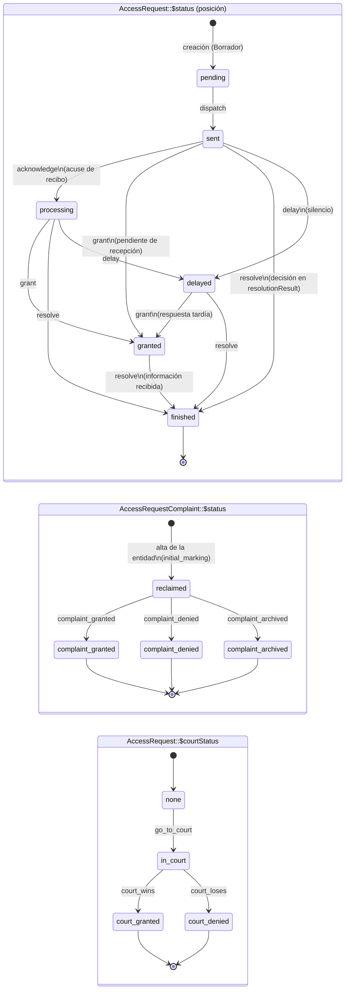
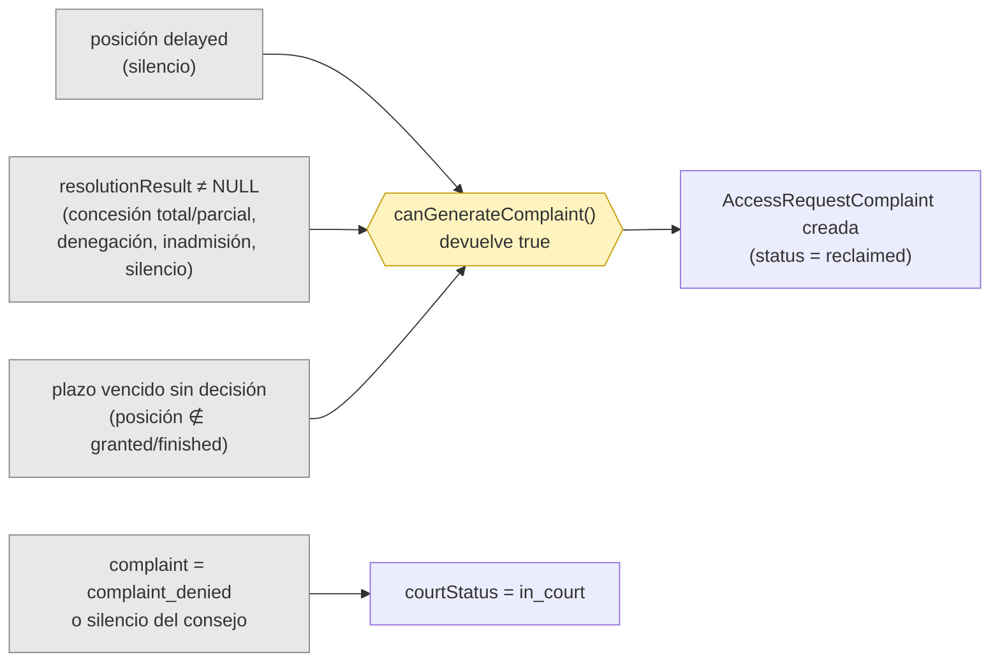

# Workflow de solicitudes

Ciclo de vida completo de una solicitud de acceso desde su presentación hasta la resolución.

## Estados

### Posición (`AccessRequest::$status`) — 6 valores

`status` describe **la posición en el procedimiento**, NO la decisión. Desde el
rediseño (migración `Version20260721120000`) son 6 posiciones — las cuatro
terminales viejas (`granted_completed`, `partially_granted`, `denied`,
`inadmitted`) se colapsaron en `finished`, y la decisión vive ahora **siempre**
en `$resolutionResult` (`granted | partially_granted | denied | inadmitted |
silence | NULL`).

| Posición | Etiqueta | Significado |
|--------|----------|-------------|
| `pending` | Borrador | Creada pero aún no despachada (borrador previo al envío) |
| `sent` | Enviada | Presentada ante el organismo público, a la espera de respuesta |
| `processing` | En trámite | El organismo público ha acusado recibo y está tramitando |
| `granted` | Pendiente de recepción | Solicitud aprobada — a la espera de que se entregue la información |
| `finished` | Finalizada | Procedimiento terminado con una decisión (la decisión, en `resolutionResult`) |
| `delayed` | Silencio administrativo | Vencido el plazo de respuesta sin contestación |

### Estado interno derivado (`getInternalState()`) — lo que ve el usuario

La app **no muestra la posición cruda**: muestra un **estado interno derivado**
(clasificador único `AccessRequest::getInternalState()`) que colapsa posición +
resolución + reclamación + vía judicial en uno de **ocho** valores, con esta
prioridad: **judicial > reclamación abierta > reclamación resuelta (→Finalizada)
> posición**.

| Interno | Etiqueta | De dónde sale |
|---------|----------|---------------|
| `draft` | Borrador | posición `pending` |
| `sent` | Enviada | posición `sent` |
| `processing` | En trámite | posición `processing` |
| `pending_reception` | Pendiente de recepción | posición `granted` |
| `finished` | Finalizada | posición `finished`, o reclamación resuelta |
| `silence` | Silencio administrativo | posición `delayed` |
| `in_complaint` | En proceso de reclamación | reclamación abierta (`reclaimed`) |
| `in_court` | En proceso judicial | `courtStatus = in_court` |

Cualquier UI que muestre «un estado» debe leer `getInternalState()` /
`getInternalStateLabel()` / `getInternalStateColor()`; nunca re-derivar la
precedencia en Twig ni en una query. `getEffectiveStatusLabel/Color()` son ahora
alias de esta derivación (retrocompatibilidad).

### Estado vs. resultado — la posición en el workflow no es la decisión administrativa

`status` describe **en qué punto del procedimiento se encuentra la solicitud**; no es un registro fiable de lo que la administración ha decidido realmente. La decisión vive en `AccessRequest::$resolutionResult` (`granted | partially_granted | denied | inadmitted | silence | NULL`) y ambos evolucionan de forma independiente:

- Una solicitud puede estar en `finished` (procedimiento terminado, información recibida) mientras `resolutionResult = partially_granted` — la concesión fue parcial y cerrar el procedimiento no sobrescribe ese hecho.
- Una solicitud marcada como `granted` puede no corresponderse con lo que se entregó realmente; el ciudadano puede presentar una reclamación sin que el resultado cambie.
- `delayed` es una posición del workflow (silencio detectado); `resolutionResult = silence` es el equivalente a la decisión registrado para consumidores aguas abajo (p. ej., el mapeo de motivos de reclamación). Tanto el `delayed` manual como el automático (jobs de expiración, que pasan por `changeStatus()`) infieren `silence`.
- **Reabrir limpia la decisión.** Al volver a un estado pre-decisión (`sent`, `processing`, `pending`), `changeStatus()` pone `resolutionResult` y `resolvedAt` a `NULL`: una decisión anulada por la corrección no debe seguir alimentando estadísticas ni el generador de reclamaciones. La prórroga que levanta un silencio (`extendDeadlineByLaw()`) hace lo mismo, pero solo si el resultado era el `silence` inferido — una decisión expresa previa nunca se toca por esa vía.

La misma ortogonalidad se aplica al lado de las reclamaciones — véase `docs/complaint-workflow.md`.

## Diagrama del ciclo de vida

Generado a partir de `config/packages/workflow.yaml`. Las tres máquinas de estado son ortogonales: la solicitud (`AccessRequest::$status`) avanza por la principal, y la reclamación (`AccessRequestComplaint::$status`) y la vía judicial (`AccessRequest::$courtStatus`) corren en paralelo cuando aplican.



### Disparadores de la creación de cada flujo paralelo



> Los terminales del diagrama de estados son terminales **del workflow principal**, no del expediente: la solicitud puede seguir generando actividad vía reclamación o vía judicial sin que `$status` cambie. La sección [Relación con `AccessRequestComplaint`](#relación-con-accessrequestcomplaint) detalla la ortogonalidad y cómo los terminales conviven con los flujos paralelos.

## Ciclo de vida

### 1. Creación

Una solicitud puede crearse de tres maneras:

**Creación manual.** La persona usuaria rellena un formulario con título, descripción, organismo público, ley aplicable, fecha de envío y, opcionalmente, un número de referencia externo. El sistema calcula el plazo de respuesta a partir de la fecha de envío y la ley aplicable.

**Creación a través del agente.** "Realizar" permite redactar y despachar una solicitud nueva al agente. El selector detecta automáticamente qué canal de presentación corresponde (`ChannelResolver`):

- **AGE Portal de Transparencia** cuando `PublicBody.transparencyPortalAmbId !== null` (el `idAmb` del wizard; el agente construye con él la URL `/procedimiento/formulario?idProc=133628&idAmb={ID}`). El campo informativo `transparencyPortalUrl` no determina el canal.
- **REG / RED SARA** cuando el organismo tiene al menos un `RegDestination` activo importado desde DIR3 (véase `docs/documentacion-procesos-envio/redsara_reg.md`). Los borradores REG recogen `expone` y `solicita` (máx. 4000 caracteres cada uno) en lugar de una única descripción, y requieren la dirección postal y el teléfono de la persona usuaria (`/perfil/datos-personales`) antes del envío.

#### Selección de destinatario (modal de búsqueda unificada)

El picker de "Realizar solicitud" (`templates/solicitudes/realizar/picker.html.twig`,
controlador Stimulus `assets/controllers/realizar_picker_controller.js`) usa un **modal de
búsqueda de destino** (sustituye a la antigua cascada nivel→ámbito→organismo→unidad). El marcado
y los estilos viven en dos parciales compartidos (`templates/_partials/organism_picker.html.twig`
y `_partials/organism_picker_styles.html.twig`) que reutiliza también "Solo redactar".

El usuario pulsa **"Añadir destinatario"** y busca en un único campo por **nombre o código
DIR3** (p. ej. «medio ambiente Galicia» o «A12048934» — la cascada anterior no encontraba por
código y ocultaba unidades tras el organismo paraguas, p. ej. las 333 unidades de "Comunidad
Autónoma de Galicia"). El modal:

- Consulta `GET /solicitudes/nueva/realizar/destinos.json?q&nivel&comunidad&provincia&limit&offset`
  (`app_solicitudes_realizar_destinations_json`), servido por `App\Service\Submission\DestinationSearch`.
- Devuelve una lista **unificada** de candidatos de dos granos mutuamente excluyentes: unidades
  **REG** (`reg_destination` cuyo `submissionTarget` no es un cuerpo Portal) y cuerpos
  **Portal/AGE** (`transparencyPortalAmbId`). La partición respeta `ChannelResolver` (Portal
  tiene prioridad sobre REG), así que un cuerpo con portal aparece una vez como portal y sus
  unidades REG quedan ocultas.
- Casa **tokenizando** la query: cada palabra debe aparecer (AND) en `name`, `dir3Code`,
  `comunidad` o `provincia` (sin acentos, vía `unaccent`), de modo que «medio ambiente galicia»
  encuentra una unidad de Galicia llamada «…MEDIO AMBIENTE…» aunque «Galicia» no esté en el
  nombre sino en la comunidad. Con facetas `nivel/comunidad/provincia` (opciones en
  `.../destinos-facetas.json`) y **paginación por offset** (carga más al hacer scroll con
  `IntersectionObserver`, más botón "Cargar más").
- Los resultados keyword se **ordenan por relevancia** (`match_rank` en `searchUnifiedCandidates`):
  `0` nombre exacto, `1` prefijo de nombre, `2` todos los tokens en el `name`, `3` solo casa por
  `dir3`/`comunidad`/`provincia`. Esto evita que una coincidencia exacta (p. ej. «AGENCIA TURISMO
  DE GALICIA») quede sepultada por debajo de otras. Query vacía (modo browse) = `match_rank 0`
  constante → orden alfabético como antes.
- En la primera página, cuando hay pocas coincidencias literales, incorpora sugerencias
  semánticas del store `ai_reg_destinations` (`RegDestinationRetriever`), solo si no coinciden ya
  con el predicado keyword (para no duplicar entre páginas). Degrada a keyword si el store está
  vacío. El **orden final** de la mezcla es: coincidencias literales fuertes (`match_rank ≤ 2`) →
  sugerencias semánticas → coincidencias literales débiles (`match_rank 3`), de modo que un match
  exacto siempre supera a un hit semántico flojo, conservando las sugerencias como descubrimiento
  por debajo.
- **Trabajo futuro (no implementado):** exportar los destinos a Elasticsearch, replicando el stack
  de `Resolution` (índice en `fos_elastica.yaml` con analizador español, listener + mensaje +
  handler de indexación, query factory, worker de populate/consume). Daría relevancia léxica BM25,
  tolerancia a erratas/derivaciones y autocompletado, pero es una construcción mucho mayor y aun
  así necesitaría una política de mezcla léxico↔semántica, así que se aplaza.

Cada candidato seleccionado se apila en el panel derecho; se pueden añadir varios. "Continuar"
hace `POST /solicitudes/nueva/realizar/iniciar` (`app_solicitudes_realizar_initiate`) con
`{ targets: [{ publicBodyId, regDestinationId? }] }` (portal → solo `publicBodyId`; REG →
`publicBodyId` = submissionTarget + `regDestinationId`), **sin cambios** en `initiateDrafts`.

Detalle de diseño:
`docs/superpowers/specs/2026-07-04-mcp-generate-request-reg-destinations-design.md` (store REG) y
el plan del modal unificado. Los endpoints antiguos `organismos.json` / `facetas.json` /
`unidades.json` siguen existiendo (los consumía la cascada) pero el picker ya no los usa.

**"Solo redactar" (borrador sin envío).** `/solicitudes/nueva/redactar`
(`app_solicitudes_draft_only`, `templates/solicitudes/draft-only-picker.html.twig`) usa el
**mismo modal de búsqueda** reutilizando los parciales compartidos y el controlador
`realizar-picker` con `data-realizar-picker-draft-only-value="true"`. "Continuar" hace el mismo
`POST /solicitudes/nueva/realizar/iniciar` pero con `{ targets, draftOnly: true }`; en ese modo
`initiateDrafts` marca cada solicitud con la metadata `draft_only` y **omite la comprobación de
datos personales REG** (se difiere al momento de "Enviar" desde el lienzo, ya que el borrador no
se despacha todavía). Ambos flujos aterrizan en el mismo lienzo de redacción
(`app_solicitudes_realizar_draft`).

**Asistente de redacción.** El canvas "Realizar" alberga un único asistente conversacional (`AssistantChatController` → `POST /asistente/request/{id}`, SSE; controlador Stimulus `assistant-chat`). El modelo **decide automáticamente** en cada turno si responder con una pregunta o actuar sobre el canvas:
- El system prompt codifica una política de tres acciones y pide al modelo que emita la respuesta conversacional, después un marcador literal `===DECISION===` y luego un bloque JSON `{"action":"reply"|"generate"|"rewrite", "draft":{…}}`.
- `App\Service\AI\StreamingDecisionSplitter` separa el stream del LLM en torno al marcador, de modo que los tokens del chat pueden enviarse en vivo mientras el JSON se acumula y se parsea al final.
- El composer es un textarea multilínea (Enter para enviar, Shift+Enter para salto de línea) y acepta adjuntos (PDF/PNG/JPG/CSV/TXT/MD; ≤4 MB/archivo, ≤5 MB total) que viajan como `ContentPart`s solo en ese turno — no se persisten en S3.
- Después de cada `rewrite`, la burbuja del sistema incluye un botón "Ver cambios" (controlador `diff-modal`) que abre un modal con un diff línea a línea del título + EXPONE/SOLICITA (o cuerpo único) frente al snapshot anterior. No se almacena historial de versiones en base de datos; el snapshot vive en los data-attributes de la burbuja del chat solo durante esa sesión.
- **Modelo «append».** Cada `generate`/`rewrite` **no** reescribe la hoja en el sitio: congela la hoja anterior (`paper-sheet#freeze` → read-only, no autosave, no envío) y **añade una hoja nueva** al final del hilo (`assistant-chat#_applyDraftToSheet`). Solo la última hoja es editable, se autosalva y se despacha; el borrador único que se persiste en servidor es siempre el de la última hoja. Al recargar, la conversación vuelve a "v1 en vivo": historial de chat + la última hoja. La hoja nueva se dibuja con la animación de caja (`.is-gen`: punto → línea → rectángulo) y luego el texto se teclea (máquina de escribir). `assistant-chat#_sheetController` espera a que Stimulus conecte el controlador de la hoja clonada mediante `setTimeout` (no `requestAnimationFrame`, que se pausa en pestañas en segundo plano y colgaría el render si el usuario cambia de pestaña a mitad de generación).
- **Fuentes utilizadas.** Si el modelo apoya el borrador en resoluciones/criterios/sentencias, las devuelve en `draft.sources` (`[{type, reference, label}]`). `AgentChatOrchestrator` las resuelve con `CitationLinkResolver` (resolución → ficha interna `/resoluciones/{id}`; criterio/sentencia → `sourceUrl` externo), las emite en el evento SSE `decision` como `sources`, y `AssistantChatController` las persiste en `AccessRequest.metadata['cited_sources']`. La hoja las pinta como *pills* bajo un separador ("Fuentes utilizadas", `paper-sheet#_renderSources`); todas abren en pestaña nueva (`target="_blank"`) para no perder el borrador. Al recargar se re-renderizan server-side desde la metadata.
  - **En el PDF** (`descargar-pdf`, autenticado y espejo público) las citas se convierten en **notas al pie numeradas**: `CitationFootnoteFormatter` localiza cada `reference` en el cuerpo (probando la referencia completa y un código normalizado tipo `R/0311/2024`), inserta un superíndice `¹²…` tras la mención y añade al final un bloque «Fuentes utilizadas» (partial compartido `pdf/_footnotes.html.twig`) con la etiqueta y el enlace. dompdf **no** ancla la nota a la página física de su marcador (no hay `float: footnote`), así que el bloque cierra el flujo de contenido; en un documento de una página se lee como notas al pie.
    - **Solicitud** (cuerpo en texto plano): `format()` escapa el cuerpo y lo devuelve como `body_paragraphs` (HTML → `|raw`); ambos controladores (autenticado y anónimo) van por el formatter.
    - **Reclamación / alegaciones** (cuerpo en HTML de Trix): `formatHtml()` tokeniza el HTML e inserta los `<sup>` **solo en los runs de texto** (nunca dentro de etiquetas ni atributos), preservando el marcado; se usa en las cuatro rutas de PDF de reclamación (autenticada `download_pdf`/`pdf`, espejo anónimo). El flujo de reclamación persiste `cited_sources` en metadata en cada `generate`/`rewrite` (igual que solicitud), pese a que el borrador-Document siga siendo efímero hasta «Guardar».
- **Línea de trámite.** La columna de chat lleva un hilo vertical con nodos-evento reales en mono: "Borrador creado · hace X" (de `AccessRequest.createdAt`) y "Guardado · hace X" (de `updatedAt`, se actualiza en cada autosave vía el evento `paper-sheet:saved`). Los tiempos relativos se refrescan cada 30 s.
- **Captura de trazas de entrenamiento.** Justo antes de emitir el evento `decision`, `AgentChatOrchestrator` pasa la conversación completa del turno (system prompt, historial, tool calls con sus resultados y la decisión final) a `AgentTurnTraceCapture`, que la vuelca como línea JSONL en `AGENT_TRACE_CAPTURE_DIR` (un fichero por **tarea** y día; variable vacía = desactivado, que es el defecto). Es la fuente de material para destilar SLMs con Distil: la telemetría de Langfuse del agente solo guarda resúmenes (`{"messages": N}`) y no sirve para eso. Los turnos multipart se aplanan a texto (los adjuntos se sustituyen por `[adjunto no textual omitido]`). Detalles que importan al usar el corpus:
  - El fichero se parte por **tarea**, no por flujo: reclamaciones y respuestas a alegaciones comparten `flow = complaint` pero son tareas distintas (ver `AgentChatOrchestrator::taskLabel()`).
  - También se capturan los turnos que **mueren en la validación** (`status` = `invalid_json`, `invalid_action`, `missing_draft`, `llm_error`), porque son justo los fallos que la destilación pretende corregir. Filtra por `status = ok` para entrenar.
  - Cuando salta el nudge anti-re-plan del flujo complaint, la conversación guardada es la **limpia** (sin los dos turnos sintéticos que el nudge inyecta) y la línea queda marcada con `nudged: true`.
  - Cada línea lleva modelo, rol (`teacher`/`student`), temperatura y versión del prompt de Langfuse, para que un corpus recogido a lo largo de semanas siga siendo separable y reproducible.
  - **Aviso**: el volcado contiene expedientes reales de ciudadanos en texto plano. Acota acceso y retención, y decide explícitamente si entra en backups.

- **Modelo teacher para recogida.** `ModelRouter` puede servir un porcentaje de turnos (`TEACHER_MODEL_SAMPLE`) con un modelo grande (`TEACHER_MODEL`, `TEACHER_MODEL_ENDPOINT`) en lugar del de siempre; su salida es la que recibe el usuario. El modelo se elige **una vez por turno**, de modo que el bucle de tools y la decisión final salen siempre del mismo. El teacher tiene que soportar tool calling y `response_format: json_schema` estricto, o el agente falla en seco. Vacío = desactivado.
- **Preguntas a mitad de flujo.** El último mensaje que ve el modelo es SIEMPRE el turno real del usuario: no existe ninguna inyección posterior (la antigua pre-call de preferencias añadía un turno sintético «Procede ahora…» detrás de la pregunta del usuario y empujaba a redactar por inercia; se eliminó porque las preferencias ya viajan en el system prompt vía `WritingPreferencesFormatter` en los tres composers). El `TOOLS_PROTOCOL_PREAMBLE` (protocolo de doctrina: leer documentos → buscar resoluciones/criterios → redactar) está acotado explícitamente a turnos `generate`/`rewrite`: si el usuario pregunta, el modelo puede usar las mismas herramientas para documentar la respuesta pero debe contestar con `reply` sin tocar el canvas. Además, cada turno assistant persistido en el historial lleva la clave `action` (`reply`/`generate`/`rewrite`…), y `AgentChatOrchestrator::toLlmHistory()` añade un marcador solo-LLM (`[En este turno generé/reescribí el borrador…]`) para que el modelo distinga qué turnos pasados actuaron sobre el canvas; el marcador nunca se renderiza al usuario (`_history.html.twig` solo pinta `content`).

El prompt de generación de la solicitud se gestiona en Langfuse bajo el nombre `pideinfo-request-generate-request-chat`, con fallback bundled en `config/prompts/request/generate-request-chat.md`. El reparto entre Langfuse y PHP sigue una regla: lo **editable/afinable** vive en el prompt gestionado —el contenido de dominio (rol, guía de canal, marco de resoluciones, reglas de redacción) **y la política de decisión** `reply`/`generate`/`rewrite` (con `{{state}}` inyectado desde PHP)—; lo **acoplado al parser** se mantiene inline en `RequestPromptComposer::outputContract()`: el contrato de formato JSON (nombres de campo, límites, «solo JSON», `conversational_reply` en HTML) y los bloques de canal REG/Portal. Motivo: una edición en Langfuse que se cargue un placeholder o cambie la forma del JSON rompería el parseo (`StreamingDecisionSplitter`) en silencio, mientras que afinar el tono de la política no. Al mover la política a Langfuse hay que subir versión (`app:langfuse:sync-prompts` empuja el bundled como nueva versión `production`; para dev recuerda mover también el label `staging`) y mantener el fallback bundled en sync.

**Redacción anónima (`/redactar`).** El mismo asistente conversacional está abierto sin cuenta: el visitante crea un `AccessRequest` sin dueño (organismo real o el centinela «Organismo por determinar»), redacta con el chat, y descarga el PDF (con la línea `A/A:` en blanco si el destinatario está por determinar). El borrador vive referenciado en la sesión, no puede enviarse, y se asocia al usuario al registrarse o iniciar sesión. Anti-abuso: Turnstile + limiters por IP + topes de sesión y de turnos. Véase `docs/anonymous-drafting.md`.

**Generación vía MCP (`generate_access_request`).** Un cliente MCP puede generar un borrador `pending` en una sola llamada, sin el chat interactivo: la tool construye la `AccessRequest` (organismo + `RegDestination` + ley), invoca `RequestDraftGenerator` —que reutiliza `RequestPromptComposer` y la normalización de draft `applyDraft` compartida con `AssistantChatController`— y llama a `LlmClient::chatJson()` una vez. El borrador queda etiquetado con `metadata.generated_via = mcp/{client_id}` y listo para revisar/enviar. El destinatario REG se localiza antes con `search_reg_destinations` (búsqueda semántica DIR3). Véase `docs/mcp.md`.

**Creación automática a partir de documentos.** Cuando una persona usuaria sube un documento clasificado como solicitud (`DocumentType::Request`) o acuse de recibo (`DocumentType::Receipt`), y no se encuentra ninguna solicitud que coincida, el sistema la crea automáticamente. La IA extrae el título, la descripción, el organismo público, la ley aplicable y la fecha de envío a partir del documento.

En el momento de la creación:
- `DeadlineCalculator::calculate()` computa el plazo inicial
- Se crea una entrada en `DeadlineHistory` con motivo `initial`
- El estado se establece en `sent`

#### Marco legal inyectado en el prompt

`RequestPromptComposer` pega en el system prompt, **literalmente**, dos bloques que antes el
modelo tenía que recordar (ver [docs/legal-framework.md](legal-framework.md)):

1. **La ley de transparencia aplicable.** `ApplicableLawResolver` ya sabe cuál rige el organismo;
   `ApplicableLaw.boeId` la enlaza con su texto y `LegalFrameworkComposer` inyecta sus artículos
   clave (plazos, límites del art. 14, causas de inadmisión del art. 18, vía de reclamación).
2. **El régimen de la calidad en que se ejerce el derecho.** Si el usuario es **concejal o cargo
   electo**, el cauce no es la Ley 19/2013 sino el art. 77 LBRL y los arts. 14-16 del ROF —
   silencio **positivo** a los **cinco días**—, y se inyecta su texto literal. La calidad vive en
   el perfil (`User.requesterCapacity`) y se puede sobreescribir por solicitud
   (`AccessRequest.metadata['requester_capacity']`, resuelto por `RequesterCapacityResolver`).

Para todo lo demás —la ley de la **materia**: LCSP en un contrato menor, LGS en subvenciones,
Ley 27/2006 en medio ambiente— el agente tiene las tools `find_law`, `search_legislation` y
`read_law_articles`, y la regla dura de **no citar ningún artículo que no haya leído**.

### 2. Acuse de recibo

Cuando el organismo público envía un acuse de recibo, la solicitud pasa a `processing`. Esto puede ocurrir mediante:
- La subida de un documento de acuse de recibo (detectado automáticamente por la IA)
- El cambio manual de estado

Si se recibe un documento de inicio de tramitación (art. 20.1 Ley 19/2013), el plazo se **recalcula** a partir de la fecha de inicio de tramitación, ya que el cómputo de 1 mes empieza desde que el organismo inicia formalmente la tramitación.

### 3. Seguimiento de plazos

El plazo de respuesta es la fecha más crítica. Depende de la ley aplicable:

| Ley | Plazo | Unidad |
|-----|-------|--------|
| Ley 19/2013 (estatal) | 1 mes | Calendario |
| Leyes autonómicas | Varía (15-30 días) | Hábiles o calendario |

#### Ampliaciones

Los organismos públicos pueden ampliar el plazo una vez (art. 20.1 Ley 19/2013). Cuando se sube un documento de ampliación:
- `AccessRequestManager::extendDeadlineByLaw()` calcula el nuevo plazo
- Se crean entradas tanto en `DeadlineHistory` (motivo: `extension`) como en `StatusHistory`
- Se incrementa el contador de ampliaciones

#### Suspensión por derechos de terceros

Si la información solicitada afecta a terceras personas (art. 19.3 Ley 19/2013), el plazo se suspende durante 15 días hábiles:
1. `suspendForThirdPartyAllegations()` — registra los días restantes y suspende el plazo
2. El estado de terceros se fija en `pending`
3. Tras recibir las alegaciones (o al expirar el periodo de 15 días): `resumeFromThirdPartyAllegations()` — suma los días restantes desde la fecha de reanudación

#### Traslados

Si el organismo público no dispone de la información, traslada la solicitud al organismo competente:
- El organismo público original se conserva en `originalPublicBody`
- Se establece el nuevo organismo público
- Se registra la fecha del traslado
- Una entrada en el timeline anota el traslado

### 4. Resolución

La resolución es un movimiento en **dos ejes**: la decisión de la administración se registra en `resolutionResult` (desplegable «Resolución» del detalle, o inferida por el análisis de documentos) y la posición del procedimiento avanza a `granted` (pendiente de recepción) o `finished` (finalizada). Los casos:

**Concesión (pendiente de recepción)** — posición `granted`, `resolutionResult = granted` (inferido si faltaba). La administración ha dicho que sí, pero la información puede no haberse entregado todavía; un banner invita a confirmar la recepción (→ `finished`). Se fija `resolvedAt`.

**Finalizada** (`finished`) — el procedimiento termina. La posición NO dice cómo terminó: eso lo dice `resolutionResult` (`granted` = información recibida tras concesión; `partially_granted` = concesión parcial; `denied` = denegación expresa, motivo en `resolutionNotes`; `inadmitted` = inadmisión, p. ej. art. 18 Ley 19/2013). Cualquier decisión desfavorable o parcial abre la vía de reclamación; `ComplaintGenerator` adapta el prompt al `resolutionResult`. El banner de concesión parcial ofrece, además de reclamar, el atajo **Marcar como finalizada** (→ `finished`) que conserva `resolutionResult = partially_granted`.

**Silencio administrativo** (`delayed`) — El plazo vence sin respuesta. Conforme a la legislación española, esto equivale a una denegación. El sistema lo detecta mediante `isDeadlinePassed()`, que devuelve `false` en cuanto existe una decisión expresa (`hasReceivedResponse()` mira `resolutionResult ∈ {granted, partially_granted, denied, inadmitted}`) — una parcial o una inadmisión con el plazo vencido **no** está en silencio. La transición automática la ejecutan los jobs de expiración (`app:requests:update-expired` y `UpdateExpiredRequestsHandler`) a través de `changeStatus()`, con lo que también queda `resolutionResult = silence` (inferido). La persona usuaria puede reclamar frente al silencio.

### 5. Vías posteriores a la resolución

Tras la resolución, la solicitud puede entrar en fases adicionales:

```
granted (pendiente de recepción)
      │
      └──► finished (usuario confirma la recepción)

resolutionResult desfavorable / delayed
      │
      ├──► Complaint filed (see complaint-workflow.md)
      │         │
      │         ├──► Complaint granted → Compliance deadline set
      │         ├──► Complaint denied → Court action possible
      │         └──► Complaint archived
      │
      └──► Court action (courtStatus)
              ├──► in_court
              ├──► court_granted
              └──► court_denied
```

## Despacho al agente y protección contra envíos duplicados

Cuando una solicitud se presenta a través del agente (canal Transparencia AGE o REG/RED SARA) o cuando se presenta una reclamación vía agente (CTBG), el sistema crea una entidad `AgentTask` que el agente retira y ejecuta. Esta sección describe los mecanismos que evitan el doble registro. El usuario puede consultar el historial completo de sus `AgentTask` —con estado, error y solicitud asociada— en `/perfil/agente`.

### El desenlace `uncertain` de `AgentTask`

`AgentTask` tiene tres estados terminales: `done`, `failed` y **`uncertain`**.

`uncertain` se emite cuando el agente pierde visibilidad *después* de pulsar el botón de firma — la "frontera de la firma". A partir de ese clic, el portal puede haber registrado la solicitud server-side aunque el agente no llegue a leer la confirmación. Reportar `failed` en ese punto invitaría a un reenvío a ciegas y a un duplicado; `uncertain` señala que el resultado es desconocido y que el canal requiere reconciliación manual antes de reintentar.

El endpoint `POST /api/agent/tasks/{id}/complete` acepta el campo `outcome` con los valores `done | failed | uncertain`. Los agentes anteriores que no envíen `outcome` pueden seguir usando el booleano `success` como fallback.

### `AccessRequest.metadata['submission_uncertain']`

Cuando una tarea termina en `uncertain`, el endpoint almacena en `AccessRequest.metadata['submission_uncertain']` un objeto `{channel, taskId, at}` que identifica el canal afectado y el momento del fallo. Este flag se elimina automáticamente cuando:

- Un envío posterior se confirma con `done` en ese mismo canal, o
- La solicitud se vuelve a despachar pasando la confirmación explícita (`confirmUncertain`).

### `AccessRequest.metadata['portal_markers']`

Por cada tarea de envío completada (sea cual sea el desenlace), el endpoint guarda en `AccessRequest.metadata['portal_markers'][type]` los marcadores del portal capturados por el agente. Para el canal Transparencia AGE el marcador relevante es `idBorr` (el identificador del borrador en el portal). Este campo persiste independientemente del resultado y sirve de base para la reconciliación posterior.

### `SubmissionGuard` — puerta fail-closed antes del despacho

`src/Service/AccessRequest/SubmissionGuard.php` se ejecuta en `dispatchBatch` (canales Transparencia y REG) y en `ComplaintController` (canal CTBG) antes de crear cualquier `AgentTask` de presentación. Cierra dos vías independientes de duplicado:

**V2 — Concurrencia.** Un índice único parcial en la tabla `agent_task` (`uniq_agent_task_active_per_request`, creado en `Version20260520120000`) garantiza como máximo una tarea no terminal (`pending | claimed | in_progress`) por par `(access_request_id, type)`. `SubmissionGuard` lo comprueba también a nivel de aplicación; si ya hay una tarea en vuelo, devuelve la razón `active_task` y el despacho se omite sin error visible.

**V1 — Falso negativo.** Si la solicitud tiene un flag `submission_uncertain` activo en el canal en cuestión (REG o CTBG — canales sin borrador persistente), `SubmissionGuard` devuelve `uncertain_needs_confirmation` y el despacho responde con HTTP 409. El usuario debe verificar el portal y confirmar explícitamente (`confirmUncertain=1`) antes de que se admita un nuevo envío. Este bloqueo NO aplica al canal Transparencia, que se auto-reconcilia (véase abajo).

### Auto-reconciliación de Transparencia AGE

Cuando `SubmissionGuard` detecta un `idBorr` guardado en `portal_markers` para el canal Transparencia, lo inyecta en el payload de la nueva `AgentTask` como `reconcile_idBorr`. El agente, al recibir ese valor, navega directamente al borrador existente en el portal en vez de acuñar uno nuevo: si el borrador ya está registrado, captura el expediente; si no, reanuda la firma sobre ese mismo borrador. Como el portal de Transparencia solo permite registrar un borrador una vez, la deduplicación es estructural y no requiere intervención humana.

La auto-reconciliación de REG y CTBG (canales sin borrador) queda como trabajo posterior; en la versión actual estos canales se reconcilian manualmente a través del flujo `uncertain_needs_confirmation` descrito arriba.

### Modal de progreso unificado (envío masivo)

Cuando el usuario confirma el envío a uno o varios organismos, el endpoint `app_solicitudes_realizar_dispatch` crea un `AgentTask` por organismo y devuelve `tasks: [{taskId, statusUrl, bodyName}]`. El modal de progreso compartido (`templates/_partials/_agent_present_modal.html.twig`, store Alpine `agentPresent` registrado en `templates/layouts/app.html.twig`) se abre automáticamente y muestra **una fila de progreso por organismo**, sondeando `GET /panel/agent/tasks/{id}/estado` (`app_agent_task_status`) cada 2 segundos para cada una. Ese endpoint de estado vive bajo el firewall `main` (sesión de cookie); no bajo `/api/`, que es `stateless` + JWT y devolvería `401 "JWT Token not found"` al navegador.

El ciclo de vida de cada tarea se representa con estas etiquetas:

| Estado de la tarea | Etiqueta mostrada |
|--------------------|-------------------|
| `pending` | Esperando que el agente comience la tarea… |
| `claimed` | Agente conectado, preparando… |
| `in_progress` | Realizando presentación… |
| `done` | Confirmación de presentación realizada |
| `failed` | Mensaje de error con el `errorMessage` real de la tarea |
| `uncertain` | Aviso para verificar manualmente en la sede |

Cuando todas las tareas han alcanzado un estado terminal (`done`, `failed` o `uncertain`), el modal ofrece el botón **"Ver mis solicitudes"**. Cerrar el modal antes de ese punto **no cancela** las tareas en el backend; una nota informativa indica al usuario que las tareas continúan ejecutándose en segundo plano.

El antiguo controlador Stimulus `assets/controllers/agent_present_controller.js` (pastilla de estado + panel de reserva) ha sido **retirado**; toda la presentación vía agente pasa ahora por este modal compartido.

## Cálculo de plazos

El servicio `DeadlineCalculator` se encarga de toda la aritmética de fechas:

### Meses naturales
- 15 ene + 1 mes = 15 feb
- 31 ene + 1 mes = 28 feb (limitado al final de mes)

### Días hábiles
- Se excluyen los fines de semana (sábado y domingo)
- Se excluyen los festivos nacionales españoles:
  - Fijos: 1 ene, 6 ene, 1 may, 15 ago, 12 oct, 1 nov, 6 dic, 8 dic, 25 dic
  - Variables: Jueves Santo, Viernes Santo — calculados a partir de la Pascua

### La comprobación `isActive()`

Una solicitud se considera activa si:
- Su estado principal no es `granted`, `granted_completed` ni `denied` (nota: `partially_granted` e `inadmitted` también se tratan como resueltos por `hasReceivedResponse()`), O
- Tiene una reclamación activa (estado = `reclaimed`), O
- Está en sede judicial (courtStatus = `in_court`)

Esto rige el filtrado del dashboard y la lógica de alertas de plazos.

### La comprobación `isDeadlinePassed()`

Señala silencio administrativo: `false` si `hasReceivedResponse()` (cualquier decisión expresa, incluidas la estimación parcial y la inadmisión), y si no, `deadlineAt < hoy`. Es la condición del banner de silencio del detalle, del tag "Vencido" en sidebar/listados/datatable y del framing "silencio" en `SuccessAnalyzer`/`ComplaintGenerator` — por eso nunca debe re-derivarse con listas parciales de estados.

## Trazabilidad de cambios de estado

Cada cambio de estado — ya lo dispare una persona usuaria, un administrador o la subida de un documento — pasa por `AccessRequestManager::changeStatus()`, que:

1. Valida el nuevo valor de estado
2. Aplica la transición
3. Gestiona los efectos colaterales (creación de la reclamación, actualización de plazos, `resolvedAt`)
4. Crea un registro en `StatusHistory` con el valor antiguo, el nuevo, las notas y, opcionalmente, el documento que disparó el cambio

El timeline en la página de detalle de la solicitud renderiza estos registros de forma cronológica, con iconos codificados por color para los distintos tipos de evento (traslado, terceros, inicio de tramitación, ampliación, resolución). Las etiquetas las traduce `StatusHistory::getToStatusLabel()`, que cubre todos los estados principales — incluidos `partially_granted` ("Estimación parcial") e `inadmitted` ("Inadmitida"), que antes caían al valor crudo.

### Edición inline desde el detalle (desplegables de los badges)

En la cabecera del expediente (`solicitudes/show.html.twig`), quien tenga permiso `edit` puede cambiar los tres badges —**Estado**, **Resolución** y **Reclamación**— con un desplegable, sin pasar por el formulario de edición completo. Los tres POSTean al mismo endpoint `app_solicitudes_change_status` (`statusType` distinto) y pasan por `changeStatus()`, así que registran `StatusHistory` y aplican los mismos efectos colaterales que cualquier otra vía:

- **Estado** → `statusType=status` (los 9 estados del workflow; el `resolutionResult` se deriva/limpia como siempre).
- **Resolución** → `statusType=resolution`, una vía que fija `resolutionResult` **con independencia del `status`** (para el caso ortogonal legítimo: p. ej. `granted_completed` con `resolutionResult = partially_granted`). El valor `none` limpia la resolución. No toca `status`. El desplegable ofrece *Concesión total · parcial · Denegación · Inadmisión · Sin resolución*, pero **no** «Silencio administrativo»: el silencio es una posición del procedimiento (Estado `delayed`), no una decisión elegible a mano — `resolutionResult = silence` solo se infiere del status.
- **Reclamación** → `statusType=complaint` (crea/actualiza/elimina la entidad y deriva `complaintResult`); los desenlaces finos que el estado no distingue (*Estimada parcialmente*, *Inadmitida*) viajan además en el parámetro opcional `complaintResult` (`changeStatus(..., $explicitComplaintResult)`), que vence a la inferencia — y se aplica incluso cuando el estado de la reclamación no cambia. *Inadmitida* se modela como reclamación desfavorable (`complaint_denied` + resultado `inadmitted`) para no bloquear la vía judicial posterior.

Las opciones de cada desplegable las construye `App\Service\AccessRequest\RequestStatusPicker` (etiquetas desde los helpers estáticos `AccessRequest::labelForStatus()` / `labelForResolutionResult()` y `AccessRequestComplaint::labelForStatus()` / `labelForComplaintResult()`, nunca decididas en Twig).

## Recordatorios en el detalle

La barra lateral del detalle (`RequestStatusSidebar`) incluye, junto al bloque "Plazos", un bloque **"Recordatorios"** que lista los recordatorios pendientes del expediente: los `CustomDeadline` (fecha + descripción propias, con enlaces a crear/editar/eliminar vía `app_solicitudes_deadline_*`) y los avisos ligeros `Reminder` ("recuérdamelo", `ReminderRepository::findAllPendingForRequest()`).

**Recordatorio automático de solicitudes sin enviar.** El comando diario `app:requests:notify-pending` (`App\Schedule`, `0 10 * * *`) detecta solicitudes que llevan 3 días en estado `pending` (registradas pero sin confirmar como enviadas) y envía un email al usuario explicándole cómo pasarlas a «Enviada». Ver `docs/commands.md` para las opciones (`--days`, `--at-least`, `--dry-run`) y la salvaguarda `metadata['pending_reminder_sent_at']`.

## Chat de consulta libre (vista detalle)

La vista de detalle (`/solicitudes/{id}`) incluye un **botón flotante** (FAB) que abre un chat "libre", minimizable, maximizable a un diálogo grande. Es un **tercer flujo** del asistente unificado (`flow=consult`, junto a `request`/`complaint`): responde dudas sobre el expediente **y** genera cualquier escrito inline (reclamación, respuesta a alegaciones/subsanación, o un documento a medida), decidiendo y **clasificando** el tipo.

- **Streaming**: `AssistantChatController::consult()` → `POST /asistente/consult/{id}` (autenticado). Reutiliza el orquestador tal cual (el arm DEFAULT responde directo; `planRequired()` no fuerza FASE-1 fuera de `complaint`). La clasificación `doc_type` viaja como propiedad opcional del `draft` en `DECISION_SCHEMA` → el JS la usa para preseleccionar el `<select>` de guardado. Las citas resueltas se guardan **namespaced** en `metadata['consult_cited_sources']` (no colisiona con `cited_sources` de request/complaint). El historial persiste en `ai_chat_messages` (hilo `consult_chat_history`) y se retoma al reabrir el chat (`AccessRequestController::show()` lo carga con `ChatHistoryStore::load`; `_history.html.twig` re-renderiza la respuesta HTML del asistente con el filtro `sanitize_html`).
- **Hand-off al pipeline especializado**: cada turno se clasifica primero con `ConsultIntentClassifier` (LLM ligero, `temperature:0`, *context-aware* con los últimos turnos para mantener la intención a través de FASE-1 → aprobación). Si detecta intención de **redactar/ajustar una reclamación** o una **respuesta a alegaciones**, la petición se enruta al composer especializado (`ComplaintPromptComposer::compose($ar, $intent, $currentBodyHtml, [])`) con `flow='complaint'` y `forcedDocType` fijo — de modo que la generación usa el prompt/plan de calidad del flujo dedicado (FASE-1: plan de argumentos + búsqueda de doctrina por argumento), no el prompt general de consulta. Cualquier otra intención (duda, subsanación, doc a medida) usa `ConsultPromptComposer` (scaffold gestionado `pideinfo-consult-generate-doc-chat` + bloque legal y prefs en PHP + contrato de formato en PHP con `body_html` y `doc_type`) con `flow='consult'`. El clasificador nunca bloquea el turno: ante cualquier error cae a `other` (flujo general). En `onDecision`, el `doc_type` normalizado es `forcedDocType ?? DocumentType::tryFrom($draft['doc_type'])` → el hand-off preselecciona el `<select>` correcto ("Reclamación"/"Respuesta a alegaciones") en el cliente.
- **Nudge anti-re-plan (harness)**: como el hand-off comparte modelo y prompt con el flujo dedicado, gemma puede **re-planificar** en el turno de aprobación (devuelve un `plan` con `action=reply` en vez de generar). `AgentChatOrchestrator` lo intercepta en PHP: si `!planRequired && flow==='complaint' && action==='reply' && plan no vacío`, reinyecta la decisión + un mensaje de empuje al usuario y vuelve a pedir la decisión estructurada (`chatRaw(..., DECISION_SCHEMA, maxRetries:2)`), forzando la generación sin exponerle al usuario el turno perdido. El mismo `TOOLS_PROTOCOL_PREAMBLE` intercepta además nombres de tool alucinados (p.ej. gemma emitiendo `generate` como si fuera una tool) devolviendo un mensaje correctivo en vez de un paso de error.
- **Guardar en el expediente** (`ConsultController::save`, `app_consult_save`): enruta por el tipo (editable por el usuario). `Complaint` → borrador **oficial** vía `ComplaintGenerator::saveComplaint` (lo recoge `getComplaintDraftDocument`, habilita "presentar vía agente"; confirma antes de pisar uno existente). `AlegationResponse` → `saveAlegationResponse` (text/plain; el HTML se convierte a texto). El resto (`SubsanacionResponse`, `Other`…) → `ConsultDocumentPersister`, un **documento inerte**: aparece en la lista de documentos pero **no** llama a `DocumentEffectsApplier` (no toca estado/plazos/`statusHistory` ni auto-crea reclamación), con `aiMetadata.origin='consult'`. La lista de documentos se refresca en vivo (`app_solicitudes_documents_fragment`).
- **Descargar PDF** (`ConsultController::pdf`, `app_consult_pdf`): plantilla neutra `templates/pdf/consult_document.html.twig` (sin el encabezado de reclamación) + notas al pie de cita (`CitationFootnoteFormatter::formatHtml` sobre `consult_cited_sources`).
- **Frontend**: el diálogo reutiliza el componente de chat de redacción vía el partial `templates/asistente/_chat_column.html.twig` (historial + hoja + composer, **sin** la sidebar de informe); la hoja usa `shape=complaint` con footer propio (`flow == 'consult'` en `_paper_sheet.html.twig`). La carcasa (abrir/maximizar) es Alpine; el streaming es Stimulus (`assistant-chat`), estados disjuntos. Los tipos guardables salen de `DocumentType::consultSavable()`.

**Editor unificado (sin Trix).** Todas las hojas —solicitud, reclamación, alegaciones y consulta— usan **textareas de texto plano** en Source Serif 4 (se retiró el editor Trix). Para los flujos cuyo documento se guarda como HTML (`shape=complaint`: reclamación/alegaciones/consulta) el usuario edita texto plano y el HTML se sintetiza **solo en el borde**: `paper-sheet#getHtml()` → `_plainToHtml()` para los endpoints de guardar/PDF/presentar (el backend no cambia), y al reabrir un borrador HTML `connect()` lo convierte a texto plano (`_htmlToPlain()`) en el textarea. El hidden `htmlInput` solo transporta el prefill.

## Relación con `AccessRequestComplaint`

Una reclamación se modela como una entidad separada (`AccessRequestComplaint`) con una relación **1:1 opcional** con `AccessRequest` (`AccessRequest::$complaint`, `inversedBy: 'complaint'`). La relación es ortogonal al workflow principal de la solicitud — la solicitud y la reclamación avanzan en máquinas de estado independientes:

```
AccessRequest                    AccessRequestComplaint
  $status (workflow position)       $status (workflow position)
  $resolutionResult (decision)      $complaintResult (decision)
       │                                  ▲
       │  resolves to denied/delayed/     │  1:1 optional
       │  inadmitted/partially_granted    │
       └─────────► creates ───────────────┘
```

**Acoplamiento del ciclo de vida.** Una reclamación solo puede existir una vez que la solicitud ha alcanzado un estado que lo permite (`denied`, `delayed`, `partially_granted`, `inadmitted`, o un `granted`/`granted_completed` con plazo vencido — véase `ComplaintGenerator::canGenerateComplaint()`). Una vez creada, la reclamación avanza por su cuenta — el `status` de la solicitud NO cambia para reflejar la actividad de la reclamación (una solicitud puede permanecer en `granted_completed` mientras la reclamación está en `reclaimed`).

**Dónde vive cada estado.**

| Concepto | Campo | Workflow (config/packages/workflow.yaml) | Valores posibles |
|---|---|---|---|
| Posición en el workflow de la solicitud | `AccessRequest::$status` | `access_request_status` (supports `AccessRequest`) | `pending`, `sent`, `processing`, `granted`, `granted_completed`, `partially_granted`, `inadmitted`, `denied`, `delayed` |
| Decisión administrativa de la solicitud | `AccessRequest::$resolutionResult` | — | `granted`, `partially_granted`, `denied`, `inadmitted`, `silence`, `NULL` |
| Posición en el workflow de la reclamación | `AccessRequestComplaint::$status` | `access_request_complaint` (supports `AccessRequestComplaint`) | `reclaimed`, `complaint_granted`, `complaint_denied`, `complaint_archived` |
| Decisión administrativa de la reclamación | `AccessRequestComplaint::$complaintResult` | — | `upheld`, `partially_upheld`, `dismissed`, `inadmitted`, `archived`, `NULL` |
| Fase judicial | `AccessRequest::$courtStatus` | `access_request_court` (supports `AccessRequest`) | `none`, `in_court`, `court_granted`, `court_denied` |

**Accesor de conveniencia.** Desde una solicitud, `AccessRequest::getComplaintStatus()` devuelve el estado de la reclamación o `AccessRequest::COMPLAINT_NONE` cuando todavía no existe ninguna reclamación — útil para plantillas y comprobaciones de `isActive()`, pero NO es un place del workflow (el workflow `access_request_complaint` no modela un estado `none` porque, en ese caso, la entidad simplemente no existe).

**Vías de creación.** Una reclamación se materializa cuando la persona usuaria pasa por el flujo `/redactar?mode=complaint` y la presenta (manualmente o vía el agente), cuando se establece el estado a `reclaimed` desde el desplegable, o automáticamente cuando se sube un documento clasificado como `DocumentType::Complaint` / `ComplaintReceipt` / `Alegaciones`. En todos los casos la entidad se construye con `status = reclaimed` (el `initial_marking` del workflow) y se añade al timeline unificado una entrada en `StatusHistory` con `statusType = 'complaint'`.

Para el procedimiento completo de reclamación (acuse de recibo, inicio de tramitación, subsanación, alegaciones, audiencia, ampliación, resolución, acción judicial) véase `docs/complaint-workflow.md`.

## Titularidad de las solicitudes

Las solicitudes tienen una persona propietaria. Si esa persona pertenece a una organización, todos los miembros de la organización pueden ver las solicitudes de las demás. Esto se implementa mediante `createQueryBuilderForUser()` en el repositorio, que añade una condición OR para la organización de la persona usuaria.

## Listas personalizadas

Las solicitudes pueden organizarse en colecciones `AccessRequestList` mediante la entidad puente `AccessRequestListItem` (que añade ordenación). Las listas tienen nombre, color y configuración de visibilidad. La vista de DataTable admite filtrado por lista.
